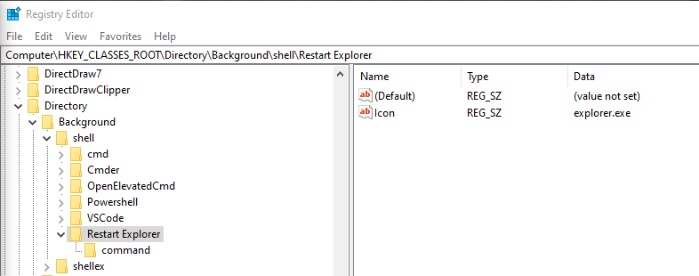
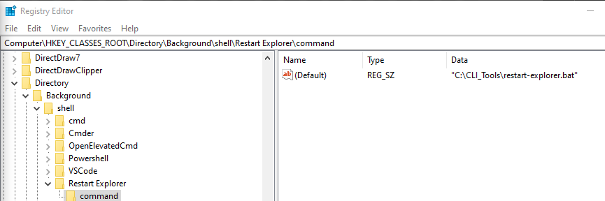
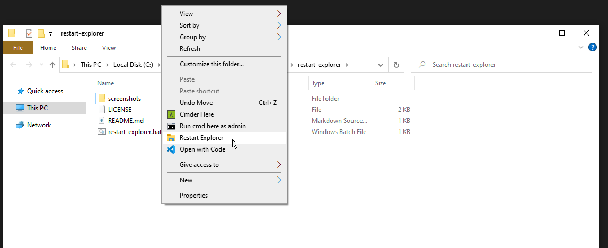

# restart-explorer

To add to context menu follow the below steps and review the below screenshots

[How To Geek Tutorial](https://www.howtogeek.com/howto/windows-vista/add-any-application-to-the-desktop-right-click-menu-in-vista/#:~:text=Adding%20Applications%20to%20the%20Desktop%20Context%20Menu&text=Right%2Dclick%20on%20the%20%E2%80%9Cshell,on%20the%20desktop%20context%20menu)

